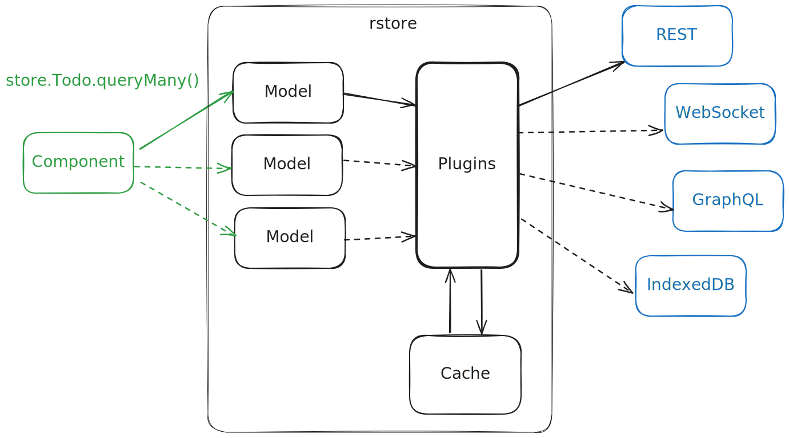
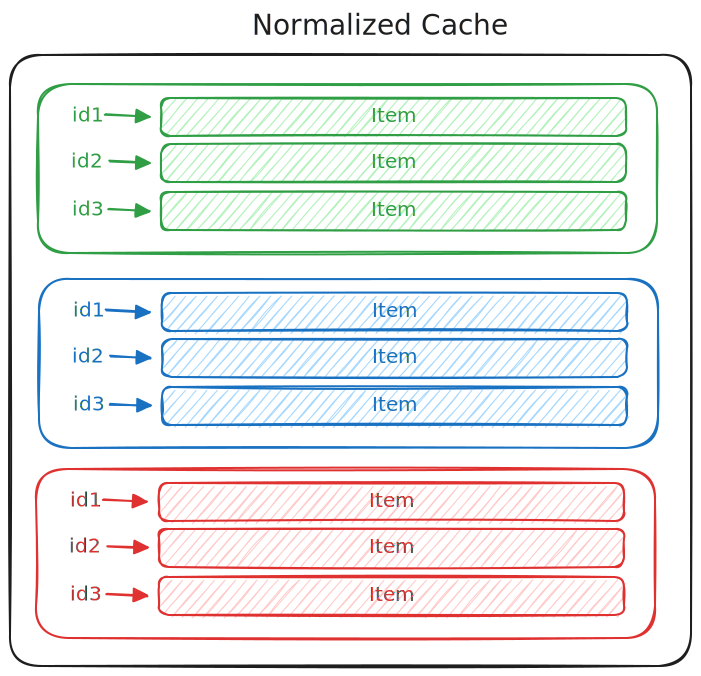
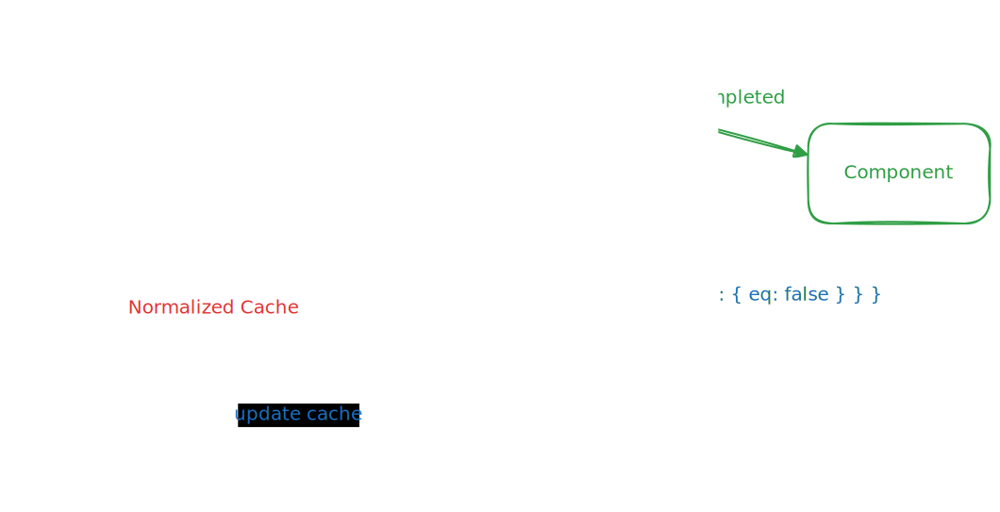
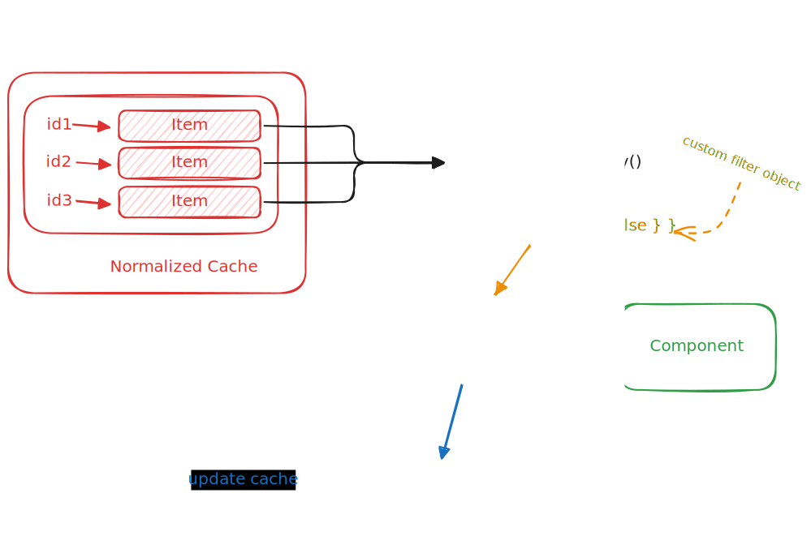

# About rstore

rstore is a powerful data store that allows you to manage all the data in your application efficiently.

With rstore, you can define a data model and then run queries or execute mutations (create, update, and delete) on your data seamlessly.

Its main features include:

- **Normalized reactive cache**: Ensures that all components are always up-to-date with the latest data changes.
- **Fully adaptable**: Comes with plugins that allow you to fetch data from any source, including REST and GraphQL.
- **Scalable**: Suitable for both small prototypes and large enterprise applications, allowing you to scale down or up as needed.
- **Local-first and realtime query API**: Designed to prioritize local data access and provide real-time updates.
- **TypeScript support**: Offers full autocomplete and type safety, making development more efficient and error-free.

Whether you're building a small prototype or a large-scale enterprise application, rstore provides the tools you need to manage your data effectively.

{.dark-only}
{.light-only}

## Use Cases

Here are some use cases for which rstore can be a great data management solution.

### Small apps and prototypes

rstore is perfect for small applications and prototypes due to its simplicity and progressiveness. You can quickly set up a data model and start managing your data with a simple plugin to handle all REST calls. You can then take advantage of the powerful API provided by the store and quickly add more Models to your app as it grows. The reactive cache ensures that your UI components are always in sync with the latest data, making development simpler and less bug-prone.

### Enterprise

For large-scale applications, rstore offers scalability, performance and extensibility. Its normalized reactive cache and plugin system allow you to manage complex data relationships and fetch data from various sources efficiently. You can scale your application as needed, from small prototypes to large enterprise solutions, without compromising on performance or maintainability.

### Data Federation

rstore's plugin system supports data federation, allowing you to fetch and combine data from multiple sources seamlessly. Whether you need to integrate REST APIs, GraphQL endpoints, or other data sources, rstore provides the flexibility to create a unified data layer for your application. This is particularly useful for applications that require data from different services or databases.

### Offline

With rstore, you can build applications that work offline by prioritizing local data access. The local-first query API ensures that your application can continue to function even when there is no network connectivity as long as all necessary data is written into the cache. Data can be synchronized with remote sources when the connection is restored, providing a seamless offline experience for users.

### Realtime and collaboration

rstore design makes it easy to add support for real-time updates and collaboration to your app *(and soon with more realtime features built into rstore)*, making it ideal for applications that require live data synchronization. The reactive cache ensures that any changes to the data are immediately reflected in the UI, and the mutation history allows replaying mutations in sync engines. Examples of realtime applications: chat apps, collaborative document editors, and other real-time interactive tools.

## Cache

The reactive normalized cache in rstore is a key feature that ensures your application's data is always consistent and up-to-date. This cache automatically normalizes the data, meaning it stores data in a structured format that eliminates redundancy and allows maintaining relationships between different items.

The cache is also reactive, meaning reading from the cache in a `computed` will always keep the components updated. In fact, each time you use `store.Todo.queryMany()` you get a computed ref that reads from the cache.

The reactive normalized cache in rstore offers several benefits.
- Consistency is maintained by normalizing the data, ensuring a single source of truth for each item, which prevents duplication and inconsistencies.
- Reactivity is another advantage, as the cache automatically updates any part of your application that depends on the data whenever changes occur, keeping your UI in sync with the latest state.
- Efficiency is achieved through the structured format of normalized data, allowing for quicker and less overhead-intensive queries and updates.
- Co-locating the data requirements with the components that use them is a powerful pattern. By using the `queryMany` and `queryFirst` composables, you can easily fetch and display data in your components without worrying about deduplicating or synchronizing with other components.

{.dark-only}{.small}
{.light-only}{.small}

::: details Example of cache

Here is what the cache can look like:

```json
{
  "Todo": {
    "4d1c0f97-4821-4012-a843-511536d64038": {
      "id": "4d1c0f97-4821-4012-a843-511536d64038",
      "completed": true,
      "text": "Meow",
      "createdAt": "2025-03-07T11:11:35.909Z",
      "updatedAt": "2025-03-07T11:12:31.659Z"
    },
    "fd50e81f-5423-4d6a-8120-2a388a9fbdfd": {
      "id": "fd50e81f-5423-4d6a-8120-2a388a9fbdfd",
      "completed": false,
      "text": "Waf",
      "createdAt": "2025-03-07T11:12:11.630Z"
    }
  }
}
```

:::

## Local-First

rstore is designed with a local-first approach, meaning that it prioritizes local data access and computation. This design choice allows for faster data retrieval and manipulation, as well as improved performance in scenarios where network connectivity may be unreliable or slow.

In practice this means that all data reads in components are computed client-size from the cache, including filtering and sorting.

{.dark-only}
{.light-only}

## Plugins

rstore's plugin system is designed to be highly adaptable, allowing you to fetch data from any source without making any assumptions about how the data should be retrieved. This flexibility ensures that rstore can be integrated seamlessly into any existing architecture or workflow.

Multiple plugins can be added to a store allowing an architecture that primarily reads from a local data source (such as local storage or IndexedDB) and then fallbacks to a remote API. Data can also be synchronized upfront and all reads can happend on a local data source.

::: info
In the future rstore will provide some builtin plugins for GraphQL, OpenAPI and other popular standards. Feel free to also share your own plugins with the community! 😸
:::

{.dark-only}
{.light-only}

::: details

The flexibility of the plugin system allows you to fetch data from various sources such as REST APIs, GraphQL endpoints, WebSockets, or even local storage. This means you are not locked into a specific data-fetching strategy and can choose the best tool for your needs.

Here is an example of how you might configure a plugin to fetch data from a REST API in Nuxt:

```js
export default definePlugin({
  name: 'my-rstore-plugin',

  setup({ hook }) {
    hook('fetchFirst', async (payload) => {
      if (payload.key) {
        const result = await $fetch(`/api/${payload.model.name}/${payload.key}`)
        payload.setResult(result)
      }
    })

    hook('fetchMany', async (payload) => {
      const result = await $fetch(`/api/${payload.model.name}`)
      payload.setResult(result)
    })

    hook('createItem', async (payload) => {
      const result = await $fetch(`/api/${payload.model.name}`, {
        method: 'POST',
        body: payload.item,
      })
      payload.setResult(result)
    })

    hook('updateItem', async (payload) => {
      const result = await $fetch(`/api/${payload.model.name}/${payload.key}`, {
        method: 'PATCH',
        body: payload.item,
      })
      payload.setResult(result)
    })

    hook('deleteItem', async (payload) => {
      await $fetch(`/api/${payload.model.name}/${payload.key}`, {
        method: 'DELETE',
      })
    })
  },
})
```

:::

## Comparisons

### Pinia

[Pinia](https://pinia.vuejs.org/) is the official state management library for Vue.js applications. While both rstore and Pinia are designed to manage application state, they have very different focuses and features.

Pinia is a successor to [vuex](https://vuex.vuejs.org/) and is primarily focused on providing a very low-level API for managing state in Vue applications. It doesn't provide any structure or specific APIs to fetch data or handle caching. Instead, it relies on the Vue Composition API to manage state and allows developers to create their own methods - which means you have to implement most of the code for caching and data fetching yourself.

| rstore | Pinia |
|--------|-------|
| Normalized reactive cache | Manual caching with Vue Composition API |
| Comprehensive query/mutation/live APIs | Write custom methods |
| Works well with standardized data sources | Very flexible data fetching |

### Pinia Colada

[Pinia Colada](https://pinia-colada.esm.dev/) is a library that provides a set of tools for data fetching and caching on top of Pinia. Its API is similar to the one of [Tanstack Query](https://tanstack.com/query/latest/docs/framework/vue/overview).

The main difference between rstore and Pinia Colada is that rstore is higher-level and provide a more structured and opinionated way to manage data. It has a built-in normalized reactive cache and provides a set of APIs for querying and mutating data, while Pinia Colada is more focused on providing a flexible API for data querying that wraps custom fetching logic.

Another important difference is that rstore is based on a normalized cache and is designed as a local-first store to enable (optional) patterns such as offline, synchronization or realtime. This means that reads are computed client-side too, while with Pinia Colada you rely by default on the server more.

| rstore | Pinia Colada |
|--------|--------------|
| Local-first (compute client-side) | Server-first with caching |
| Normalized cache | Query-based cache |
| Data structured with models | No mandatory structure |
| Fetching through plugins | Fetching in queries themselves |

### Tanstack Query

[Tanstack Query](https://tanstack.com/query/latest/docs/framework/vue/overview) is the new name of `vue-query`. The comparison would be mostly the same as [Pinia Colada](#pinia-colada).

### Vue-Promised

[Vue-Promised](https://github.com/posva/vue-promised) is a library to provide low-level utilities to help handle async operations in Vue. It is not a state management library and does not provide any caching or data fetching capabilities. Compared to rstire, it is very minimalistic and does not provide any structure or opinionated way to manage data.

### swrv

[swrv](https://github.com/Kong/swrv) is a port of [swr](https://github.com/vercel/swr) for Vue. It is a library for data fetching and caching, but it is not a state management library. It is focused on providing a simple API to fetch data following the [stale-while-revalidate pattern](https://datatracker.ietf.org/doc/html/rfc5861). You can achieve the same with rstore using the [fetchPolicy](./data/query.md#fetch-policy) set to `cache-and-fetch`.

### Apollo

[Apollo](https://apollo.vuejs.org/) is the a GraphQL client that shares some similarities with rstore. It has a normalized cache although it is not designed as local-first. It is focused on GraphQL whereas rstore is agnostic to the data source. Furthermore, rstore is much lighter than the `Apollo Client + vue-apollo` combination as it seamlessly and natively integrates with Vue and directly uses Vue's reactivity system.

| rstore | Apollo |
|--------|--------|
| Normalized reactive cache | Normalized reactive cache |
| Local-first | Server-first with cache |
| Agnostic to data source | GraphQL only |
