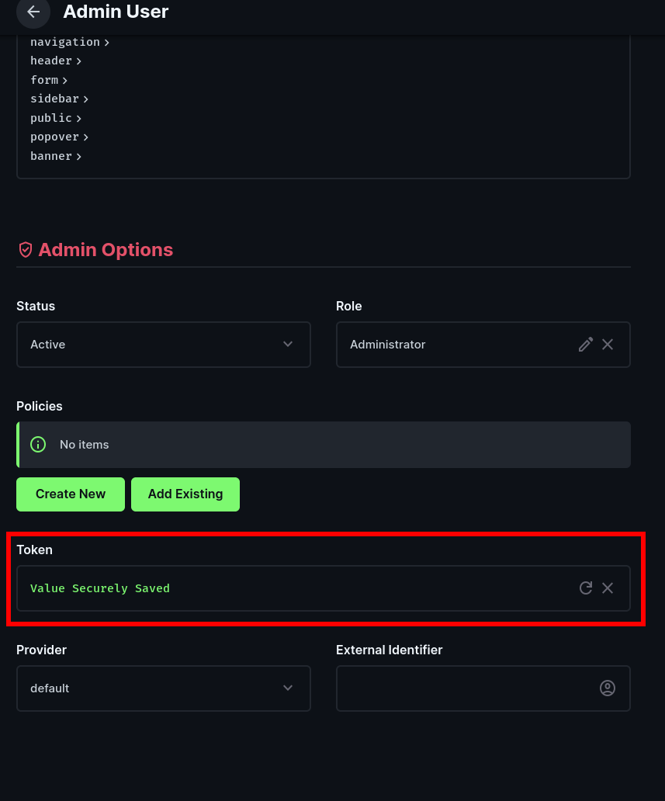

# Nuxt + Directus

This is a Nuxt module to integrate rstore with [Directus](https://directus.io/docs/) directly.

1. Install the `@rstore/nuxt-directus` module:

```bash
npm install @rstore/nuxt-directus
```

2. Go in your Directus project instance with an admin user and create a new Admin Token.



::: tip Why the Admin Token is needed?
This Admin Token will be used to automatically retrieve the collections in your Directus instance - then the module will generate from this introspection all of the necessary rstore models for you.
:::

3. Create an `.env` file and put your Directus Admin Token there:

```env
DIRECTUS_TOKEN=<paste-your-token-here>
```

4. Configure Nuxt by adding the module and setting up the directus options in your `nuxt.config.ts` file:

```ts
export default defineNuxtConfig({
  modules: [
    '@rstore/nuxt-directus',
  ],

  rstoreDirectus: {
    url: 'https://your-directus-instance.com', // The URL of your Directus instance
    adminToken: import.meta.env.DIRECTUS_TOKEN, // The admin token you created in step 2
  },
})
```

5. Now you can use the `useRstore` composable in your components to access the Directus collections:

```vue
<script lang="ts" setup>
const store = useStore()

const filter = ref<'all' | 'unfinished' | 'finished'>('all')
const { data: todos } = await store.Todos.queryMany(() => ({
  filter: filter.value === 'all'
    ? undefined
    : {
        completed: {
          _eq: filter.value === 'finished',
        },
      },
}))
</script>
```

In this example, we are accessing the collection named `Todos` in Directus, and also using the [filter rules](https://directus.io/docs/guides/connect/filter-rules) for our query. Since rstore is local-first, the filter rules will also be computed client-side.

## Filtering

You can use the `filter` option in your queries to filter the data returned from Directus. The filter rules are the same as the ones used in Directus, so you can refer to the [Directus documentation](https://directus.io/docs/guides/connect/filter-rules) for more information.

Some options are supported just yet:

- Relation filters
- `$CURRENT_USER` and `$CURRENT_ROLE` dynamic variables
- `$FOLLOW`
